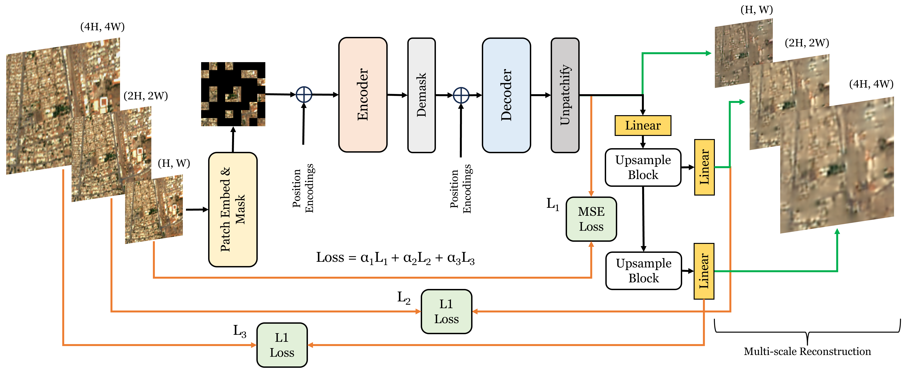

# SatMAE++: Rethinking Transformers Pre-training for Multi-Spectral Satellite Imagery (CVPR 2024)

## Updates
- **March 11, 2024:** SatMAE++ paper is released [[arXiv]](https://arxiv.org/abs/2403.05419)  [[PDF]](https://arxiv.org/pdf/2403.05419.pdf)
- **March 13, 2024:** Codebase is released.
- **March 26, 2024:** Pre-trained and Finetuned ViT-Large model weights are released. Json data split files for FMoW-RGB are uploaded.

## Overview
Different from standard natural image datasets, remote sensing data is acquired from various sensor technologies and exhibit diverse range of scale variations as well as modalities. Existing satellite image pre-training methods either ignore the scale information present in the remote sensing imagery or restrict themselves to use only a single type of data modality. Compared to existing works, SatMAE++ with multi-scale pre-training is equally effective for both optical as well as multi-spectral imagery. SatMAE++ performs multi-scale pre-training and utilizes convolution based upsampling blocks to reconstruct the image at higher scales making it extensible to include more scales.

## Method
SatMAE++ incorporates the multiscale information by reconstructing the image at multiscale levels thereby improving the performance on various scene classification downstream datasets.



------------------------------------------------------------------------------------

## FMoW-Sentinel
You can download the dataset and corresponding train/val csv files from these links [[satmae github]](https://github.com/sustainlab-group/SatMAE) [[fmow-sentinel]](https://purl.stanford.edu/vg497cb6002)

Directory structure of the dataset should be as below:

```
[Root folder]
____ train.csv
____ val.csv
____ [images folder]
________ train
____________ aiport
____________ aiport_hangar
____________ .......
________ val
____________ aiport
____________ aiport_hangar
____________ .......
```

### Pretraining
To pretrain the ViT model (default is ViT-L) using SatMAE++ approach on fmow_sentinel dataset, use the command as below:

```
CUDA_VISIBLE_DEVICES=0,1,2,3,4,5,6,7 python -m torch.distributed.launch --nproc_per_node=8 --master_port=29201 main_pretrain.py \
--batch_size 16 --accum_iter 16 \
--epochs 50 --warmup_epochs 20 \
--input_size 96 --patch_size 8 \
--mask_ratio 0.75 \
--model_type group_c \
--dropped_bands 0 9 10 \
--dataset_type sentinel --dropped_bands 0 9 10 \
--grouped_bands 0 1 2 6 --grouped_bands 3 4 5 7 --grouped_bands 8 9 \
--blr 0.0001 --num_workers 16 \
--train_path /home/fmow-sentinel/train.csv \
--output_dir ./output_dir \
--log_dir ./output_dir
```

### Finetuning
To finetune the ViT model (default is ViT-L), use the command as below:

```
CUDA_VISIBLE_DEVICES=0,1,2,3,4,5,6,7 python -m torch.distributed.launch --nproc_per_node=8 --master_port=29202 main_finetune.py \
--batch_size 8 --accum_iter 16 \
--epochs 30 --warmup_epochs 5 \
--input_size 96 --patch_size 8 \
--model_type group_c \
--dropped_bands 0 9 10 \
--dataset_type sentinel --dropped_bands 0 9 10 \
--grouped_bands 0 1 2 6 --grouped_bands 3 4 5 7 --grouped_bands 8 9 \
--weight_decay 0.05 --drop_path 0.2 --reprob 0.25 --mixup 0.8 --cutmix 1.0 \
--blr 0.0002 --num_workers 16 \
--train_path /home/fmow-sentinel/train.csv \
--test_path /home/fmow-sentinel/val.csv \
--output_dir ./finetune_dir \
--log_dir ./finetune_dir \
--finetune ./output_dir/checkpoint-49.pth
```

------------------------------------------------------------------------------------

## FMoW-RGB
You can download the dataset by following the instructions here [[fmow-github]](https://github.com/fMoW/dataset)

Download the train and validation json files [[data-split]](https://github.com/techmn/satmae_pp/tree/main/fmow_rgb_data_split). 
Alternately, you can preprocess data and create your own json/csv files using the script here [[fmow-rgb preprocessing issue]](https://github.com/sustainlab-group/SatMAE/issues/1) [[CSV Files (SatMAE)]](https://drive.google.com/drive/folders/1-xSXNpq0xJ4z3F7BPzEcZ04eZ7LqPbYD)

Directory structure of the dataset should look like as below:

```
[Root folder]
____ train_62classes.json
____ val_62classes.json
____ train
________ aiport
________ aiport_hangar
________ .......
____ val
________ aiport
________ aiport_hangar
________ .......
```

### Pretraining
Use the below command to pretrain the ViT model (default is ViT-L) on fmow_RGB dataset:

```
CUDA_VISIBLE_DEVICES=0,1,2,3,4,5,6,7 python -m torch.distributed.launch --nproc_per_node=8 --master_port=29201 main_pretrain.py \
--batch_size 64 --accum_iter 32 \
--epochs 800 --warmup_epochs 20 \
--input_size 224 --patch_size 16 \
--mask_ratio 0.75 \
--model_type vanilla \
--dataset_type rgb \
--weight_decay 0.3 \
--lr 0.0007 --num_workers 16 \
--train_path /home/fmow-rgb/train_62classes.json \
--output_dir ./output_dir \
--log_dir ./output_dir
```

### Finetuning
Use the following command to finetune the ViT model (default is ViT-L):

```
CUDA_VISIBLE_DEVICES=0,1,2,3,4,5,6,7 python -m torch.distributed.launch --nproc_per_node=8 --master_port=29202 main_finetune.py \
--batch_size 8 --accum_iter 16 \
--epochs 50 --warmup_epochs 5 \
--input_size 224 --patch_size 16 \
--model_type vanilla \
--dataset_type rgb \
--weight_decay 0.05 --drop_path 0.2 --reprob 0.25 --mixup 0.8 --cutmix 1.0 \
--lr 0.001 --num_workers 16 \
--train_path /home/fmow-rgb/train_62classes.json \
--test_path /home/fmow-rgb/val_62classes.json \
--output_dir ./finetune_dir \
--log_dir ./finetune_dir \
--finetune ./output_dir/checkpoint-799.pth
```

------------------------------------------------------------------------------------

## Downstream Datasets
Data splits for EuroSAT, UCMerced and RESISC-45 are available at [[google-research]](https://github.com/google-research/google-research/tree/master/remote_sensing_representations).

- EuroSAT [[download]](https://github.com/phelber/EuroSAT)
- RESISC-45 [[onedrive link on page 2 paper]](https://arxiv.org/pdf/1703.00121.pdf) &nbsp; [[project website]](http://www.escience.cn/people/JunweiHan/NWPU-RESISC45.html)
- UCMerced [[download]](http://weegee.vision.ucmerced.edu/datasets/landuse.html)

------------------------------------------------------------------------------------

## Model Weights
| Model | Dataset | Top1 Acc (%) | Pretrain | Finetune |
| :---  |  :---:  |    :---:     |   :---:  |  :---:   |
| ViT-L | FMoW-Sentinel | 63.23 | [download](https://huggingface.co/mubashir04/checkpoint_ViT-L_pretrain_fmow_sentinel) | [download](https://huggingface.co/mubashir04/checkpoint_ViT-L_finetune_fmow_sentinel) |
| ViT-L | FMoW-RGB | 78.14 | [download](https://huggingface.co/mubashir04/checkpoint_ViT-L_pretrain_fmow_rgb) | [download](https://huggingface.co/mubashir04/checkpoint_ViT-L_finetune_fmow_rgb) |


## Acknowledgements
The codebase is inspired from the [SatMAE](https://github.com/sustainlab-group/SatMAE) repository. We thank them for releasing their valuable codebase. 

## Citation
```
@inproceedings{satmaepp2024rethinking,
      title={Rethinking Transformers Pre-training for Multi-Spectral Satellite Imagery}, 
      author={Mubashir Noman and Muzammal Naseer and Hisham Cholakkal and Rao Muhammad Anwar and Salman Khan and Fahad Shahbaz Khan},
      year={2024},
      booktitle={CVPR}
}
```
